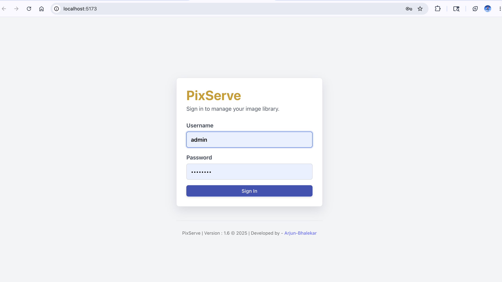
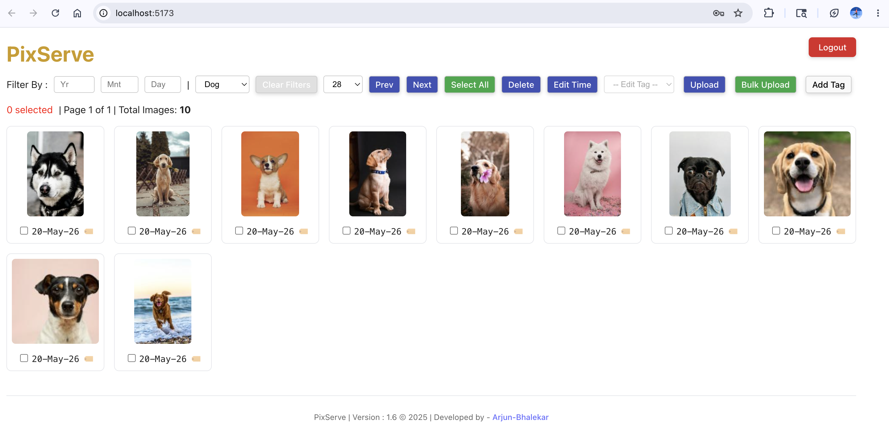

# 🖼️ PixServe

##  UI Screens : 





**PixServe** is a personal image and media management web application built using **React (frontend)**, **Spring Boot (backend API)**, and **MongoDB (database)**.

It allows you to upload, organise, and view your local images along with metadata like tags, location, and timestamps—all stored efficiently and privately.

---

## 🚀 Tech Stack

- ⚛️ **Frontend**: React (`pix-ui/`)
- ☕ **Backend**: Spring Boot (`pix-service/`)
- 🍃 **Database**: MongoDB
- 🗂️ **Storage**: Local filesystem (image files in `uploads/`)

---

## 🎯 Features

- Upload images with tags, timestamp, and location
- Store image metadata in MongoDB
- Serve and preview uploaded images
- REST API to fetch metadata and files
- Designed for local or private deployment

---

## 📁 Project Structure

```text
pix-serve/
├── README.md                         # Main project documentation
├── pix-serve-login.png               # Login screen screenshot
├── pix-serve-preview.png             # App preview screenshot
│
├── pix-service/                      # Spring Boot backend API
│   ├── README.md                     # Backend-specific documentation
│   ├── pom.xml                       # Maven project config
│   ├── mvnw                          # Maven wrapper for macOS/Linux
│   ├── mvnw.cmd                      # Maven wrapper for Windows
│   └── src/
│       ├── main/
│       │   ├── java/com/pixserve/
│       │   │   ├── PixServiceApplication.java
│       │   │   ├── controller/       # REST APIs: auth, images, tags
│       │   │   ├── dto/              # Request/response DTOs
│       │   │   ├── model/            # MongoDB document models
│       │   │   ├── repository/       # Spring Data MongoDB repositories
│       │   │   ├── runner/           # Startup bulk upload runner
│       │   │   ├── security/         # JWT auth and Spring Security config
│       │   │   ├── service/          # Business logic and file storage
│       │   │   └── util/             # Metadata extraction and hashing helpers
│       │   └── resources/
│       │       ├── application.properties
│       │       └── static/           # Built frontend assets served by backend
│       └── test/                     # Backend tests
│
└── pix-ui/                           # React frontend app
    ├── README.md                     # Frontend-specific documentation
    ├── package.json                  # Frontend dependencies and scripts
    ├── vite.config.*                 # Vite configuration
    ├── public/                       # Static public assets
    └── src/                          # React source code
```

> Image files are stored in the directory configured by `base.dir.path` in `pix-service/src/main/resources/application.properties`. The current backend config points to `/Users/arjunbhalekar/pix-serve-storage`, outside this repository.
